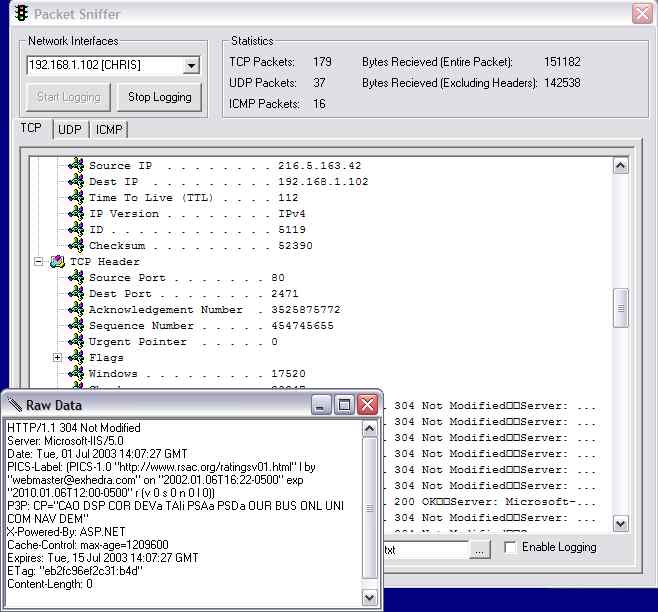



## Raw Packet Sniffer \(Bugs Fixed\)

### Description

This is an update to the first packet sniffer I submitted yestarday. It got alot of good feedback so I decided to resubmitt it with all the bugs fixed. It currently has support for 3 protocols (TCP, UDP and ICMP) and can very easily be expanded to include more. The packet sniffer itself is wrapped in a very object oriented fashoin allowing you to just plug it right into your own apps. NOTICE: This will only work on OS' with raw socket support (Windows XP/2000/NT) with root access (admin privilages).
 
### More Info
 

             |
---                |---
**Submitted On**   |2003-06-30 22:17:26
**By**             |[IRBMe](https://github.com/Planet-Source-Code/PSCIndex/blob/master/ByAuthor/irbme.md)
**Level**          |Intermediate
**User Rating**    |4.8 (443 globes from 92 users)
**Compatibility**  |VB 5\.0, VB 6\.0
**Category**       |[Internet/ HTML](https://github.com/Planet-Source-Code/PSCIndex/blob/master/ByCategory/internet-html__1-34.md)
**World**          |[Visual Basic](https://github.com/Planet-Source-Code/PSCIndex/blob/master/ByWorld/visual-basic.md)
**Archive File**   |[Raw\_Packet160824712003\.zip](https://github.com/Planet-Source-Code/irbme-raw-packet-sniffer-bugs-fixed__1-46567/archive/master.zip)

